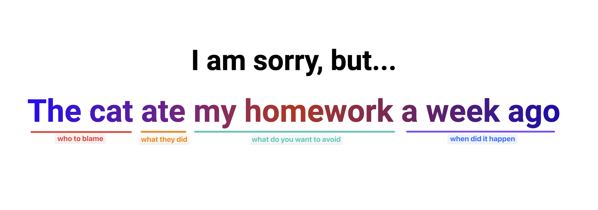

# Excuse Generator
Dodging awkward situations just got a whole lot easier! The Excuse Generator is a fun, lighthearted project perfect for anyone who loves a good laugh (or needs a quick way out). 🎉 With just few lines of JavaScript, it’s simple to build, easy to use, and guaranteed to save you from those annoying moments—or at least give you a great story to tell!

🗒️ **How to Start This Project?**
---
1. **Ensure You Have a GitHub Account**
   If you don't have one, sign up at [https://github.com](https://github.com/).
2. Navigate to the project template
   - Create a repository from the template to your account
   - Open the project with a new codespace
   - Once you did it once you can open the codespace that was previously created.
---

📝 **Instructions**
---
Create a simple website that generates random, hilarious excuses every time you refresh the page. Think of it as your ultimate “I’m sorry, but…” machine!

Here is an example: 

The idea is to randomly generate each part of a sentence, resulting in uniquely entertaining excuses!
---

### Hints:
- Start with your index.html by adding a single, hardcoded excuse. Verify that it displays correctly on your page.
- Add some basic styling with CSS to make your excuse generator visually appealing.
- In JavaScript, create separate arrays to hold different parts of the excuse (e.g., subjects, actions, objects, and timings).
- Use string concatenation to combine elements from these arrays into a complete excuse.
- Introduce randomness! Use JavaScript to pick random elements from each array to generate new excuses every time.

### **🤔 What to Do If You Are Stuck?**
#### **Review Fundamentals:**
- Review the JS materials covered.
#### **Ask for Help:**
- Reach out to your instructor or peers for assistance

---
### **📚 Fundamentals Covered**
#### This exercise covers the following fundamentals:
1. **HTML Basics**
    - Setting up an HTML file with a placeholder for dynamic content.
2. **CSS**
    - Styling the excuse display area for better visual appeal.
3. **JavaScript Basics:**
    - Declaring and working with arrays.
    - Generating random numbers.
    - Concatenating strings to form sentences.
    - Manipulating the DOM.
---

### **✅ Submission Checklist**
- [ ] HTML file contains a properly styled excuse display area
- [ ] JavaScript generates excuses dynamically on page load
- [ ] Arrays include at least four creative elements for each part of the sentence
- [ ] The project runs smoothly without errors
- [ ] Code is clean, well-organized, and commented where necessary
---

### **✨ Alternative Options for This Project**

- 🐶 **Classic Excuse Generator**:  
  Generate excuses like "The dog ate my homework this morning" using relatable elements for everyday situations.

- 🐉 **Fantasy Adventure Excuse Generator**:  
  Create fun fantasy-themed excuses like "A dragon stole my sword last night" for an adventurous twist.

- 📂 **Funny Office Excuse Generator**:  
  Build workplace-related excuses such as "The intern misplaced the report before the meeting" for a humorous spin.

- 🎉 **Apology Generator for Social Situations**:  
  Apologize creatively with excuses like "I accidentally forgot your birthday last weekend" for social mishaps.

- 🧠 **Custom Themes**:  
  Experiment with unique themes, like a **superhero excuse generator** ("Spider-Man webbed my laptop last night") or a **tech-themed excuse generator** ("The AI chatbot rewrote my code this morning").

Each alternative option can be a standalone project or a variation for advanced users to explore creative possibilities! 🎨
